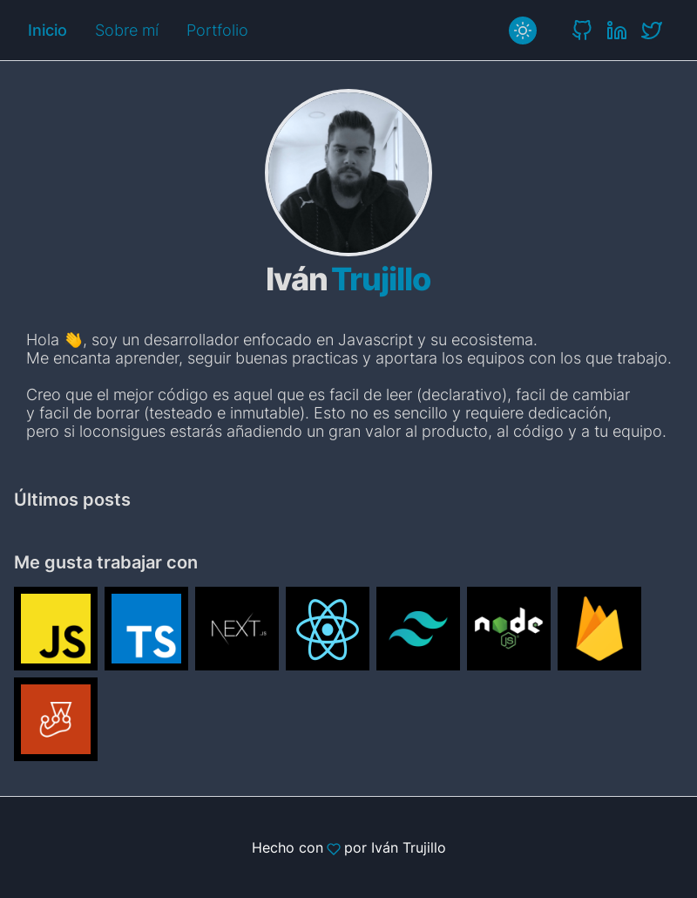
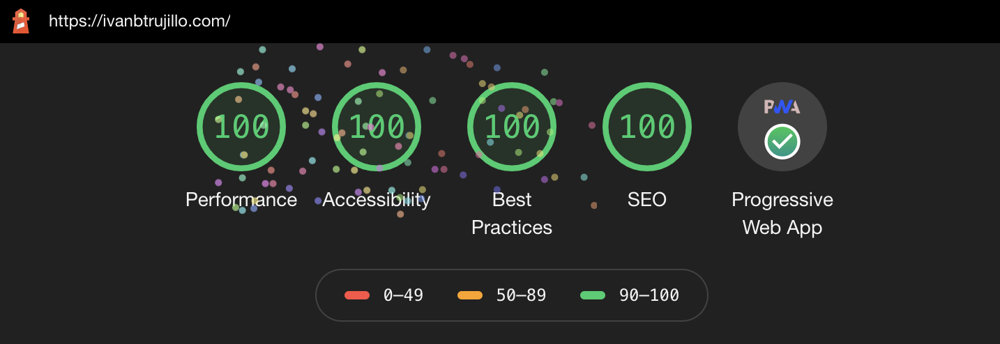

# ivanbtrujillo.com

This is my personal website. It is open source, so you can fork it or clone it if you want.

## The approach

I use Github issues as the repository for my blog posts and matter to parse metadata content. Then I use Auth0 to authenticate users, allowing them to leave comments if they want. They won't need a github account, due I store his name and image as comment metadata.

I've created a theme toggler to switch between light and dark theme.

In order to show code in the blog posts I use prism-react-renderer.

## Technologies

- Typescript
- NextJS
- TailwindCSS

It is PWA ready.
It has a 100% Lighthouse Performance Score.

## License

MIT
